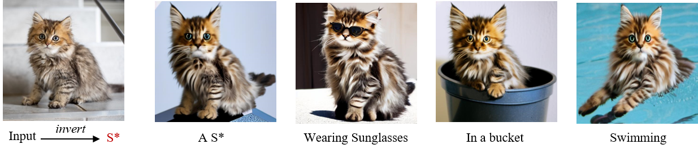
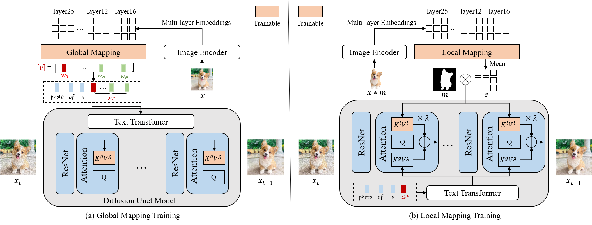

# ELITE Tutorial for Customized Text-to-Image Generation

## 🚀 Try It Now on Colab! 🧪🎨

We **highly recommend** using our **online Colab notebook** to quickly try out the ELITE framework — no setup required!  
Click below to get started instantly with a free GPU (T4 supported):  

👉 [**Launch ELITE on Colab**](https://colab.research.google.com/drive/1EpicdzK0iLtxCYv0A3nfXk4tKQ-k_hW_?usp=sharing) 👈  

> ✅ **No installation needed**  
> 💡 **Free T4 GPU access**  
> 🔧 **Fully runnable demo with example data**




## Method Details



Given an image indicates the target concept (usually an object), we propose a learning-based encoder ELITE to encode the visual concept into the textual embeddings, which can be further flexibly composed into new scenes.  It consists of two modules: (a) a global mapping network is first trained to encode a concept image into multiple textual word embeddings, where one primary word (w0) for well-editable concept and other auxiliary words (w1···N) to exclude irrelevant disturbances. (b) A local mapping network is further trained, which projects the foreground object into textual feature space to provide local details.

## Getting Started

### Environment Setup

```shell
git clone https://github.com/Oliiveralien/ELITE-Tutorial
cd ELITE-Tutorial
conda create -n elite python=3.9
conda activate elite
pip install -r requirements.txt
```

If you are using 50 series GPUs (like RTX5060), you may encounter this error: "NVIDIA GeForce RTX 50XX with CUDA capability sm_120 is not compatible with the current PyTorch installation."
That's because Stable Pytorch is currently incompatible with 50 series GPUs. There is a way to fix this by using nightly Pytorch (ignore the torch and torchvision in requirements.txt). See this issue [here](https://github.com/comfyanonymous/ComfyUI/issues/7127).
Torch 2.9.0.dev20250803 + CUDA 12.8 works on RTX 5060 Ti. 

If this error happens: "Could not load library libcudnn_cnn_infer.so.8.", you need to install cudnn with version 8. See this issue [here](https://github.com/vladmandic/sdnext/discussions/540). 
CUDA 12.8 + cuDNN 8.9.7 works on RTX 3070.

If you want to rent a remote GPU, check out [Vast](https://vast.ai/) or other platforms.


### Pretrained Models

Download checkpoints in [Google Drive](https://drive.google.com/drive/folders/1y7KOo8T7FkknWLbFrbAvgYbha2xipXYs?usp=drive_link). Then save to the directory `./checkpoints`.

How to download files from Google Drive in Linux? -> check out [gdown](https://github.com/wkentaro/gdown).

```shell
pip install gdown
```

### Customized Generation

There are some testing pairs in [test_datasets](./test_datasets), which contain both images and object masks. 

For testing, you can run the shell script.
```
bash inference_local.sh
```
Change the image folder (DATA_DIR) and prompt (template) for your own customization.

If you want to test your customized dataset, you should align the image to ensure the object is at the center of image, and also provide the corresponding object mask. 

The object mask can be obtained by any image matting method. Try [SAM](https://segment-anything.com/)!

SAM [demo](https://segment-anything.com/demo) and [GitHub](https://github.com/facebookresearch/segment-anything).
